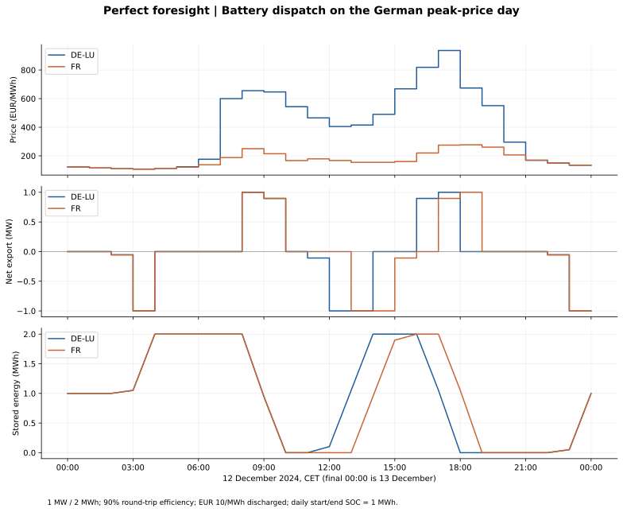

# Perfect-foresight BESS benchmark — 2024

## What we did and why

We optimised a separate 1 MW / 2 MWh battery in DE-LU and France for every local delivery day in 2024. The optimiser knows that day's actual prices. This creates an oracle benchmark: the best net operating margin within our daily constraints. Later, forecasts will replace those prices in the decision step; settlement will still use observed prices. The difference measures the financial cost of imperfect information under this experiment.

This is not demonstrated live trading income, a deployable forecast strategy, or a full battery investment valuation. It is not an unrestricted annual optimum: daily SOC restoration prevents inter-day arbitrage. For each day, a forecast-driven schedule under identical constraints cannot outperform the perfect-foresight objective except within solver tolerance.

## Assumptions and reasons

| Assumption | Choice and reason |
| --- | --- |
| Power / usable energy | 1 MW / 2 MWh: a simple two-hour asset |
| Efficiency | 90% round-trip, split symmetrically as sqrt(0.90) for charge and discharge |
| SOC | 0–2 MWh; each day starts and finishes at 1 MWh, avoiding a free terminal energy drawdown |
| Cycling cost | Illustrative EUR 10 per grid-side MWh discharged; not an empirically calibrated lifetime model |
| Timing | Hourly intervals, grouped by Europe/Berlin delivery date; DST days contain 23 or 25 hours |
| Operation | Binary mode prevents simultaneous charging and discharging, including at negative prices |
| Objective | Maximise sales minus purchases minus discharged-energy cycling cost |
| Trading | Price-taking, full acceptance, no market impact; each zone independent |
| Other costs | Fees assumed zero; capex, fixed O&M, taxes, grid tariffs, standby losses and auxiliary loads excluded |
| Other revenues | Intraday, balancing and ancillary services excluded |

## Mathematical model

For hourly charge c, discharge d and stored energy s:

- s[t+1] = s[t] + eta_charge*c[t] - d[t]/eta_discharge.
- 0 <= c[t] <= P*u[t]; 0 <= d[t] <= P*(1-u[t]); u is binary.
- 0 <= s[t] <= E; s[0] = s[T] = 0.5*E.
- Maximise sum(price[t]*(d[t]-c[t]) - cycling_cost*d[t]).

All intervals are one elapsed hour, so MW multiplied by one hour gives MWh. The implementation uses Pyomo and the HiGHS mixed-integer solver with a requested relative MIP gap of 1e-8. Every solve must terminate optimally. The same net objective is used to choose schedules and compare their outcomes.

## Annual results

| zone | hours | gross_margin_eur | degradation_eur | net_margin_eur | charge_mwh | discharge_mwh | equivalent_full_cycles |
| --- | --- | --- | --- | --- | --- | --- | --- |
| DE-LU | 8784 | 77,343.36 | 11,782.75 | 65,560.60 | 1,309.19 | 1,178.28 | 621.01 |
| FR | 8784 | 55,266.96 | 12,203.87 | 43,063.09 | 1,355.99 | 1,220.39 | 643.20 |

Currency columns are EUR for one battery. Energy columns are MWh. Equivalent full cycles use internal discharged energy divided by usable capacity: grid-side discharged MWh / discharge efficiency / 2 MWh. This counts energy throughput, not rainflow cycles or predicted degradation.



Net export is positive when discharging and negative when charging. SOC is shown at interval boundaries. The future price spike is known to this benchmark; the chart must not be presented as successful spike prediction.

## December sensitivity: one assumption changed at a time

| scenario | zone | gross_margin_eur | net_margin_eur | discharge_mwh |
| --- | --- | --- | --- | --- |
| efficiency_85pct | DE-LU | 5,273.64 | 4,623.13 | 65.05 |
| efficiency_85pct | FR | 3,759.00 | 3,012.17 | 74.68 |
| degradation_0 | DE-LU | 6,010.63 | 6,010.63 | 108.85 |
| degradation_0 | FR | 4,596.45 | 4,596.45 | 134.45 |
| degradation_20 | DE-LU | 5,655.89 | 4,467.26 | 59.43 |
| degradation_20 | FR | 4,085.67 | 2,749.14 | 66.83 |
| main | DE-LU | 5,893.28 | 5,137.69 | 75.56 |
| main | FR | 4,402.01 | 3,500.95 | 90.11 |

These are re-optimised schedules, not simply revised accounting on the main schedule. Different scenarios have different objectives or constraints, so their net margins are not interchangeable oracle bounds. Zero cycling cost can admit multiple equally optimal dispatch schedules. At negative prices, sequential cycling can earn revenue partly by absorbing energy losses; simultaneous charging/discharging remains prohibited.

## Validation and reproducibility

All 732 daily problems were solved (366 per zone), covering 8,784 hours each. Each dispatch is checked for SOC bounds, power limits, energy balance, continuity, terminal SOC, mutual exclusivity and nonnegative daily net objective (idle is feasible). Analytical tests cover flat positive prices, a known two-hour arbitrage outcome, negative prices and both DST day lengths.

Source: the existing hourly dataset; only prices are used. The one missing French actual-fundamentals hour does not affect this model. The German Sequence 1 auction metadata limitation remains; see [price provenance](price_comparison_2024.md). Outputs are conditional on the selected price series.

```bash
python -m pip install -r requirements.txt
python scripts/analyse_fundamentals.py  # if processed data is absent
python scripts/analyse_battery.py
PYTHONPATH=src python -m unittest discover -s tests
```

Full dispatch is recreated in git-ignored `data/processed/battery_dispatch_2024.csv`. Published outputs: [daily margins](battery_daily_2024.csv), [annual summary](battery_summary_2024.csv), [December sensitivity](battery_december_sensitivity_2024.csv), [peak-day dispatch](battery_dispatch_2024-12-12.csv), and [run metadata](battery_validation_2024.json).

## What comes next and why

Use a simple historical price forecast to choose the same daily schedule before the declared auction cutoff. Settle that fixed schedule using actual prices and retain identical battery constraints. Compare MAE, extreme-event detection and net margin against this oracle. This makes Michael's forecast-to-financial-value question measurable, while the December case study provides Andreas's market context. Add ML only after the baseline and timestamp checks work.
