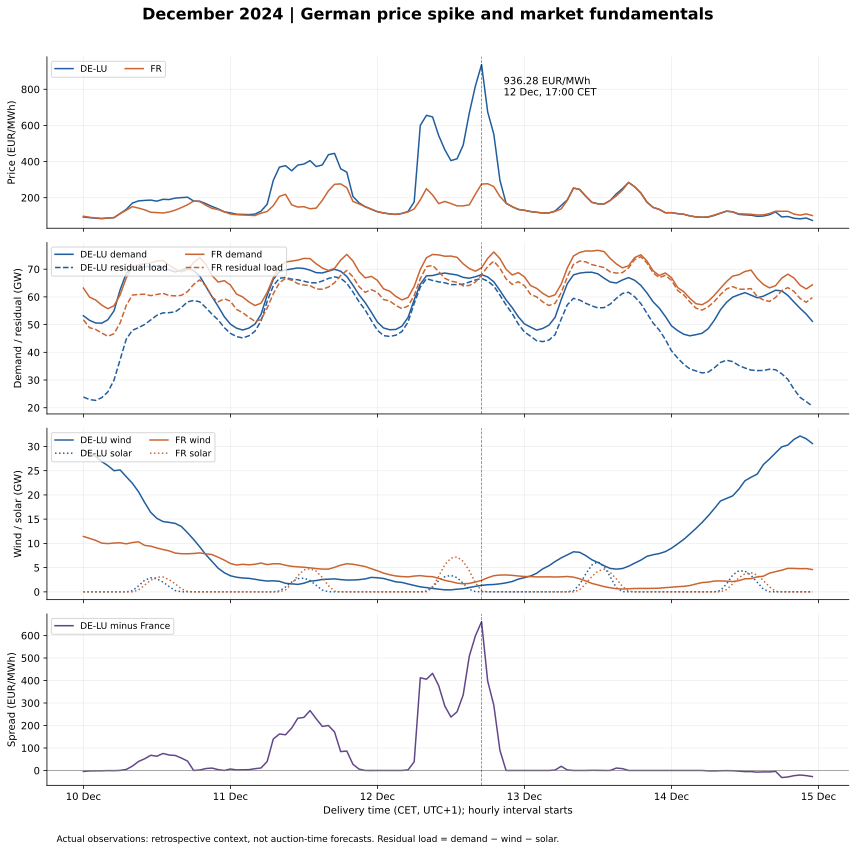

# December 2024: a German price spike in a wider European context

**Finding:** at 17:00–18:00 CET on 12 December, the supplied DE-LU price series reached **EUR 936.28/MWh**, while France was **EUR 275.00/MWh**. The contemporaneous spread was **EUR 661.28/MWh**. German actual wind and solar totalled **1.37 GW**, leaving **66.67 GW** of demand after subtracting these two sources.



## Peak-hour observations

| zone | price_eur_mwh | demand_mw | wind_mw | solar_mw | residual_load_mw |
| --- | --- | --- | --- | --- | --- |
| DE-LU | 936.28 | 68,037.75 | 1,343.00 | 27.75 | 66,667.00 |
| FR | 275.00 | 70,486.00 | 2,370.50 | 191.50 | 67,924.00 |

Power columns are MW; prices are EUR/MWh. Residual load excludes only wind and solar, not nuclear, hydro or other generation. These are national fundamentals paired with zonal prices (Germany versus DE-LU).

Against the **other December weekdays at 17:00 CET**, German median demand was **66.97 GW**, wind **20.49 GW**, solar **0.01 GW**, and residual load **40.74 GW**. The matched comparison contains 21 hours and controls for time of day and weekday status, but not weather, holidays or outages.

The event residual load was at or above **95.2%** of those matched hours. Low wind/solar output alongside substantial demand is consistent with greater demand for other generation and imports. This is an interpretation of observed conditions, not a causal decomposition of the auction price.

## Month-wide context

| zone | hours | mean_price | min_price | max_price | negative_hours |
| --- | --- | --- | --- | --- | --- |
| DE-LU | 744 | 108.32 | -2.06 | 936.28 | 8 |
| FR | 744 | 98.18 | 3.95 | 284.21 | 0 |

December mean DE-LU minus France spread: **EUR 10.14/MWh**. Negative hours count prices strictly below zero. Top-20 tables rank December separately for each zone; ties are ordered by UTC timestamp. The plotted five-day event window was selected retrospectively around the German annual maximum and is not an unbiased forecasting test.

## What is supported, and what remains unknown

- The supplied data establishes the coincident price divergence and actual demand/renewable conditions. France's residual load cannot be interpreted as scarcity without accounting for its other generation, including nuclear.
- Actual generation and demand were not available at the preceding auction. They contextualise delivery conditions, but do not reconstruct participants' expectations.
- A large price spread does not establish the binding network constraint, the direction or volume of physical flows, or an FBMC effect. Cross-border capacity, network constraints and auction outcomes are needed.
- Generator outages, available capacity, fuel/carbon costs and submitted bids have not been analysed. We cannot attribute the spike to a particular marginal generator, strategic bidding or physical shortage.
- The German export uses Sequence 1 as in the existing pipeline; its precise auction metadata remains pending confirmation. Findings are conditional on that selection.

## Data, validation and reproduction

Inputs are the existing validated hourly price/fundamentals dataset built from user-supplied ENTSO-E price exports, SMARD actuals and RTE eco2mix actuals. See [the fundamentals report](fundamentals_2024.md) for provenance, source definitions and the French DST gap. That gap is outside December.

December contains **744 unique, complete hours per zone**, with no missing core inputs. The plot contains 120 hours per zone. Filtering uses local delivery dates; joins use UTC. Daily spreads are arithmetic means of the 24 hourly spreads, not price ratios. No missing values are filled.

```bash
python scripts/analyse_fundamentals.py  # if the processed file is absent
python scripts/analyse_december.py
```

The second command recreates this report, the chart and these tables:

- [Top 20 hours per zone](december_top20_hours_2024.csv)
- [Hourly spreads](december_hourly_spreads_2024.csv)
- [Daily mean spreads](december_daily_spreads_2024.csv)
- [Event-versus-baseline comparison](december_peak_comparison_2024.csv)
- [Monthly summary](december_summary_2024.csv)

## Implication for the next experiment

This episode motivates testing whether price forecasts capture financially important extremes. It does not demonstrate a profitable battery strategy. Next build the 1 MW / 2 MWh perfect-foresight benchmark with explicit efficiency, cycling and terminal-energy assumptions; then compare forecast-driven schedules under identical constraints.
