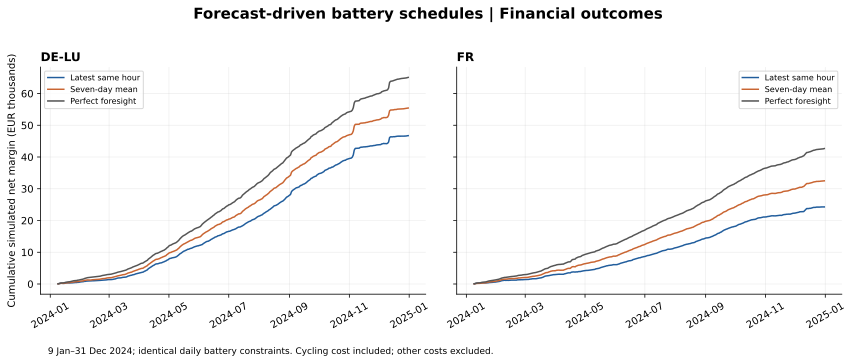

# Historical forecast baselines: accuracy versus battery margin

## What we did and why

We replaced perfect future prices in the battery decision with two transparent historical forecasts. We then froze the resulting charge/discharge schedule and valued it using actual prices. This isolates how price information changes financial decisions while holding the physical model constant.

The test covers **9 January–31 December 2024: 358 days and 8,592 hours per zone**. The first eight local days supply history. All strategies, including the oracle, are evaluated on exactly this period; do not compare these totals directly with the earlier full-year oracle totals.

## Information timing and forecast definition

For delivery day D, we define an experimental decision cutoff of **09:00 local time on D-1**. This is a chosen modelling cutoff, not a verified exchange gate-closure rule. We conservatively use only complete delivery days **D-8 through D-2**, even though some newer day-ahead prices may already be known. Historical exports lack publication-vintage metadata, so the backtest assumes prices for fully elapsed delivery days were available and unchanged at the cutoff. This assumption is not independently verified.

- **Latest same hour:** use the most recent observed daily price for the target local hour in that history, normally D-2. If that hour is absent due to spring DST, fall back to the previous available day.
- **Seven-day same hour:** average the daily same-hour values over those seven days. A repeated autumn hour is averaged within its historical day first, giving each day equal weight. A missing spring hour is omitted. Both repeated target autumn hours receive the same forecast.

No target-day actual demand, generation, prices or spreads enter the forecast. Every source delivery interval ends before the cutoff. Tests verify that changing data after the historical boundary cannot change the forecast.

## Battery decisions and settlement

The Pyomo/HiGHS model and assumptions are unchanged: 1 MW / 2 MWh, 90% round-trip efficiency, EUR 10 per grid-side MWh discharged, 50% starting/terminal SOC each day, no simultaneous charge/discharge. All quantities are assumed accepted at actual day-ahead prices. This remains a simplified price-taking auction experiment, without bid rejection, market impact, fees, imbalance costs or intraday adjustment.

The optimiser maximises expected net margin at forecast prices. Settlement applies actual prices to those fixed quantities. Realised daily losses are retained; we never retrospectively cancel an unprofitable day. Forecast-based optimisation's nonnegative expected margin is not a guarantee of nonnegative realised margin.

## Results

| zone | model | mae_eur_mwh | net_margin_eur | oracle_gap_eur | worst_day_eur | loss_days |
| --- | --- | --- | --- | --- | --- | --- |
| DE-LU | latest_same_hour | 35.33 | 46,725.03 | 18,350.79 | -64.62 | 28 |
| DE-LU | perfect_foresight | 0.00 | 65,075.82 | 0.00 | 9.29 | 0 |
| DE-LU | seven_day_same_hour | 29.52 | 55,430.47 | 9,645.35 | -33.92 | 11 |
| FR | latest_same_hour | 26.55 | 24,277.07 | 18,385.69 | -56.57 | 40 |
| FR | perfect_foresight | 0.00 | 42,662.76 | 0.00 | 7.48 | 0 |
| FR | seven_day_same_hour | 23.53 | 32,492.27 | 10,170.49 | -39.77 | 19 |

All margins are EUR per illustrative battery, after assumed cycling cost and before other costs. MAE is hourly weighted in EUR/MWh. Oracle MAE is zero by construction, not predictive skill.

- DE-LU: lower MAE came from **seven_day_same_hour**; higher net margin came from **seven_day_same_hour**. The rankings agree in this sample.
- FR: lower MAE came from **seven_day_same_hour**; higher net margin came from **seven_day_same_hour**. The rankings agree in this sample.

These are descriptive results from one retrospectively studied year, not a universal ranking or an untouched investment validation set. Neither baseline was tuned to maximise these reported results. Future ML needs a separately defined chronological validation/test protocol.



## Extreme-event diagnostics

We use a fixed illustrative spike threshold **strictly above EUR 200/MWh**, and negative prices **strictly below zero**. These definitions were chosen for this experiment, not tuned as a trading trigger. Precision is true events divided by predicted events; recall is detected events divided by actual events. Undefined ratios are left missing, not replaced with zero.

| zone | model | spike_precision | spike_recall | actual_spike_hours | negative_precision | negative_recall | actual_negative_hours |
| --- | --- | --- | --- | --- | --- | --- | --- |
| DE-LU | latest_same_hour | 0.18 | 0.18 | 129 | 0.19 | 0.19 | 446 |
| DE-LU | seven_day_same_hour | 0.04 | 0.04 | 129 | 0.31 | 0.05 | 446 |
| FR | latest_same_hour | 0.24 | 0.24 | 25 | 0.20 | 0.20 | 344 |
| FR | seven_day_same_hour | nan | 0.00 | 25 | 0.27 | 0.13 | 344 |

Ratios are fractions between zero and one. Event prediction is distinct from financial capture: battery SOC and charge/discharge constraints also determine which opportunities can be used. Event metrics alone do not establish why one strategy earned more.

## Checks and reproducibility

We solved 2,148 daily problems (two forecasts plus the oracle, for 358 days in each zone). Every schedule passes the existing physical checks. Settlement leaves its quantities and SOC unchanged, and its actual net margin never exceeds the same-day oracle beyond numerical tolerance. Both DST transition days are included. The French missing actual-fundamentals hour does not matter because these baselines use prices only. The German Sequence 1 metadata limitation remains as documented in the earlier price report.

```bash
python scripts/analyse_forecasts.py
PYTHONPATH=src python -m unittest discover -s tests
```

First run the fundamentals pipeline if the processed price dataset is absent. Full dispatch and per-day information-cutoff audit are written to git-ignored `data/processed/forecast_dispatch_2024.csv` and `forecast_timing_2024.csv`.

Published outputs: [summary](forecast_summary_2024.csv), [daily results](forecast_daily_2024.csv), [12 December schedules and settlement](forecast_dispatch_2024-12-12.csv), [validation metadata](forecast_validation_2024.json).

## What comes next and why

Inspect loss days and missed extremes before adding model complexity. Then define a chronological ML experiment with only available features and compare against these baselines on the same held-out dates. The purpose is to test whether additional forecasting skill improves net battery decisions, not merely to reduce average prediction error. Keep documenting changes to the information set, constraints and costs.
