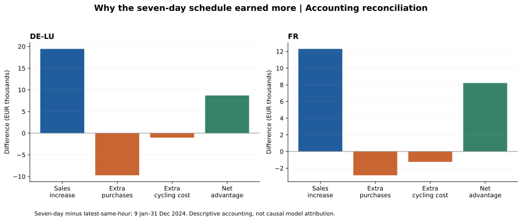

# Why the seven-day forecast earned more, and where it failed

## Scope and method

This is a retrospective diagnosis of the existing schedules; no forecasts are changed and no model is tuned. We reconcile the seven-day-minus-latest margin difference exactly, inspect losing days, and distinguish threshold detection from physical action. The common period is 9 January–31 December 2024.

## What the accounting establishes

| zone | additional_sales_eur | additional_purchases_eur | additional_degradation_eur | net_advantage_eur |
| --- | --- | --- | --- | --- |
| DE-LU | 19,449.74 | 9,715.94 | 1,028.35 | 8,705.44 |
| FR | 12,309.13 | 2,853.15 | 1,240.79 | 8,215.20 |



### DE-LU

The seven-day strategy discharged **1264.18 MWh** versus **1161.35 MWh** for the latest-hour strategy. Its weighted sale price was **EUR 117.32/MWh** versus **110.96**, and weighted purchase price **EUR 57.13/MWh** versus **54.65**. These are quantity-weighted prices of the selected transactions, not market-wide means.

Additional sales of **EUR 19449.74**, minus extra purchases of **EUR 9715.94** and cycling costs of **EUR 1028.35**, explain the **EUR 8705.44** net advantage exactly. More trading alone is not a sufficient explanation; prices and quantities both changed.

Its worst loss was **2024-02-11**: expected net margin **EUR 59.15**, actual gross margin **EUR 3.06**, cycling cost **EUR 36.97**, and realised net **EUR -33.92**. The expected opportunity failed to cover the realised cost of cycling.

Largest adverse settlement surprises on that loss day:

| delivery_local | forecast_eur_mwh | actual_eur_mwh | charge_mw | discharge_mw | shortfall_eur |
| --- | --- | --- | --- | --- | --- |
| 2024-02-11 02:00:00+01:00 | 25.57 | 52.60 | 1.00 | 0.00 | 27.03 |
| 2024-02-11 12:00:00+01:00 | 46.88 | 64.60 | 1.00 | 0.00 | 17.72 |
| 2024-02-11 13:00:00+01:00 | 45.26 | 62.12 | 1.00 | 0.00 | 16.86 |

Shortfall is (forecast price - actual price) multiplied by net export; positive values reduce realised margin relative to forecast. These are selected adverse intervals, not the complete day.

It missed the EUR 200 threshold in **124 of 129 actual spike hours**, but still discharged during **69** of those missed hours. Predicting a price below 200 can still produce discharge if that hour is relatively attractive within the forecast profile.

### FR

The seven-day strategy discharged **1326.73 MWh** versus **1202.65 MWh** for the latest-hour strategy. Its weighted sale price was **EUR 79.21/MWh** versus **77.15**, and weighted purchase price **EUR 40.25/MWh** versus **42.26**. These are quantity-weighted prices of the selected transactions, not market-wide means.

Additional sales of **EUR 12309.13**, minus extra purchases of **EUR 2853.15** and cycling costs of **EUR 1240.79**, explain the **EUR 8215.20** net advantage exactly. More trading alone is not a sufficient explanation; prices and quantities both changed.

Its worst loss was **2024-04-20**: expected net margin **EUR 129.06**, actual gross margin **EUR 7.17**, cycling cost **EUR 46.95**, and realised net **EUR -39.77**. The expected opportunity failed to cover the realised cost of cycling.

Largest adverse settlement surprises on that loss day:

| delivery_local | forecast_eur_mwh | actual_eur_mwh | charge_mw | discharge_mw | shortfall_eur |
| --- | --- | --- | --- | --- | --- |
| 2024-04-20 07:00:00+02:00 | 53.55 | 8.43 | 0.00 | 1.00 | 45.12 |
| 2024-04-20 21:00:00+02:00 | 49.07 | 10.00 | 0.00 | 1.00 | 39.07 |
| 2024-04-20 08:00:00+02:00 | 50.12 | 13.31 | 0.00 | 0.90 | 33.03 |

Shortfall is (forecast price - actual price) multiplied by net export; positive values reduce realised margin relative to forecast. These are selected adverse intervals, not the complete day.

It missed the EUR 200 threshold in **25 of 25 actual spike hours**, but still discharged during **14** of those missed hours. Predicting a price below 200 can still produce discharge if that hour is relatively attractive within the forecast profile.

## Separating trading volume and selected prices

| zone | component | contribution_eur |
| --- | --- | --- |
| DE-LU | discharge_volume | 11,737.70 |
| DE-LU | discharge_price_mix | 7,712.04 |
| DE-LU | charge_volume | -6,386.12 |
| DE-LU | charge_price_mix | -3,329.83 |
| DE-LU | cycling_cost | -1,028.35 |
| FR | discharge_volume | 9,700.15 |
| FR | discharge_price_mix | 2,608.98 |
| FR | charge_volume | -5,687.65 |
| FR | charge_price_mix | 2,834.51 |
| FR | cycling_cost | -1,240.79 |

For both purchases and sales we use the exact identity change(P*Q) = mean(P)*change(Q) + mean(Q)*change(P), where P is the transaction-weighted price and Q is energy. Purchase components enter with a minus sign. This symmetric decomposition separates volume from selected-price mix without arbitrary ordering. It is an arithmetic attribution, not evidence that smoothing alone caused a particular improvement. Weighted prices and volumes are jointly determined by whole-day schedules.

## Which hours account for the difference?

| zone | regime | hours | net_advantage_eur |
| --- | --- | --- | --- |
| DE-LU | negative | 446 | 161.33 |
| DE-LU | ordinary_0_to_200 | 8017 | 5,978.55 |
| DE-LU | spike_above_200 | 129 | 2,565.56 |
| FR | negative | 344 | 336.23 |
| FR | ordinary_0_to_200 | 8223 | 7,692.75 |
| FR | spike_above_200 | 25 | 186.21 |

These are interval-level accounting contributions, including cycling cost on discharge. They sum to the total difference. They are not standalone regime profits: charging in one regime may support discharge in another, and shifting boundaries would shift the accounting attribution.

| zone | seven_day_wins | latest_wins | ties | best_five_advantage_eur | worst_five_advantage_eur |
| --- | --- | --- | --- | --- | --- |
| DE-LU | 262 | 94 | 2 | 1,184.51 | -215.10 |
| FR | 273 | 84 | 1 | 817.91 | -222.63 |

## Failure cases worth studying

| zone | case | day_cet | model | forecast_net_margin_eur | gross_margin_eur | degradation_eur | net_margin_eur |
| --- | --- | --- | --- | --- | --- | --- | --- |
| DE-LU | worst_seven_day_loss | 2024-02-11 | latest_same_hour | 34.39 | 37.07 | 18.97 | 18.10 |
| DE-LU | worst_seven_day_loss | 2024-02-11 | seven_day_same_hour | 59.15 | 3.06 | 36.97 | -33.92 |
| DE-LU | worst_seven_day_loss | 2024-02-11 | perfect_foresight | 20.97 | 30.45 | 9.49 | 20.97 |
| DE-LU | largest_seven_day_underperformance | 2024-02-11 | latest_same_hour | 34.39 | 37.07 | 18.97 | 18.10 |
| DE-LU | largest_seven_day_underperformance | 2024-02-11 | seven_day_same_hour | 59.15 | 3.06 | 36.97 | -33.92 |
| DE-LU | largest_seven_day_underperformance | 2024-02-11 | perfect_foresight | 20.97 | 30.45 | 9.49 | 20.97 |
| DE-LU | largest_seven_day_advantage | 2024-07-15 | latest_same_hour | 130.78 | 159.54 | 18.97 | 140.57 |
| DE-LU | largest_seven_day_advantage | 2024-07-15 | seven_day_same_hour | 176.47 | 458.33 | 37.95 | 420.38 |
| DE-LU | largest_seven_day_advantage | 2024-07-15 | perfect_foresight | 475.42 | 513.37 | 37.95 | 475.42 |
| FR | worst_seven_day_loss | 2024-04-20 | latest_same_hour | 331.62 | 10.96 | 47.43 | -36.47 |
| FR | worst_seven_day_loss | 2024-04-20 | seven_day_same_hour | 129.06 | 7.17 | 46.95 | -39.77 |
| FR | worst_seven_day_loss | 2024-04-20 | perfect_foresight | 41.86 | 60.84 | 18.97 | 41.86 |
| FR | largest_seven_day_underperformance | 2024-12-13 | latest_same_hour | 340.66 | 373.83 | 37.95 | 335.88 |
| FR | largest_seven_day_underperformance | 2024-12-13 | seven_day_same_hour | 120.25 | 323.23 | 46.46 | 276.77 |
| FR | largest_seven_day_underperformance | 2024-12-13 | perfect_foresight | 358.66 | 396.61 | 37.95 | 358.66 |
| FR | largest_seven_day_advantage | 2024-04-22 | latest_same_hour | 41.86 | 89.15 | 18.97 | 70.17 |
| FR | largest_seven_day_advantage | 2024-04-22 | seven_day_same_hour | 97.67 | 287.85 | 37.95 | 249.91 |
| FR | largest_seven_day_advantage | 2024-04-22 | perfect_foresight | 339.18 | 395.13 | 55.95 | 339.18 |

Worst absolute loss and largest underperformance against the other baseline are different questions. The oracle shows that a profitable schedule could exist even when the selected forecast schedule loses. Forecast optimism is forecast-valued net margin minus actual-valued net margin for the same fixed actions; it is not a causal forecast-error decomposition.

## Missed extremes are not necessarily missed actions

| zone | model | event | actual_hours | missed_hours | missed_hours_discharging | missed_hours_charging |
| --- | --- | --- | --- | --- | --- | --- |
| DE-LU | latest_same_hour | spike_above_200 | 129 | 106 | 46 | 0 |
| DE-LU | latest_same_hour | negative | 446 | 360 | 10 | 164 |
| DE-LU | seven_day_same_hour | spike_above_200 | 129 | 124 | 69 | 0 |
| DE-LU | seven_day_same_hour | negative | 446 | 425 | 7 | 209 |
| FR | latest_same_hour | spike_above_200 | 25 | 19 | 9 | 0 |
| FR | latest_same_hour | negative | 344 | 276 | 5 | 115 |
| FR | seven_day_same_hour | spike_above_200 | 25 | 25 | 14 | 0 |
| FR | seven_day_same_hour | negative | 344 | 300 | 3 | 138 |

Spikes are prices strictly above EUR 200/MWh; negatives are strictly below zero, as in the original experiment. The optimiser reacts to the entire relative price profile, losses and cycling costs, not these diagnostic thresholds. A missed spike classification can coincide with discharge; a missed negative-price classification can coincide with charging. Neither action guarantees a good whole-day result. Oracle volumes on identical missed-event hours are available in the event CSV, but do not by themselves establish achievable incremental profit because SOC couples intervals.

## What we can and cannot conclude

The seven-day schedules earned more through a combination of different quantities and transaction prices; the tables identify those arithmetic contributions. A plausible interpretation is that averaging stabilises a useful daily price shape, but that mechanism has not been isolated experimentally. Do not claim that lower spike recall caused higher profit, or that a less accurate forecast won: the seven-day forecast also had lower MAE in this sample.

The loss cases demonstrate that a positive forecast-valued spread may be inadequate after actual prices and cycling costs. The next model should be evaluated on decision outcomes as well as MAE. Any filter inspired by these failures must be developed on training/validation dates and tested elsewhere; deleting these loss days retrospectively would bias results.

All earlier assumptions remain: historical price vintages unverified, German Sequence 1 metadata pending, fully accepted price-taking trades, daily SOC reset, and other operating/investment costs excluded. These are simulated margins, not demonstrated live trading profit.

## Reproduction and next step

```bash
python scripts/analyse_forecasts.py  # if full dispatch is absent
python scripts/analyse_failures.py
```

The analysis checks interval accounting, paired timestamps, the exact volume/price reconciliation, and the sum of price-regime contributions. Published CSVs use the `failure_` prefix, including [all losing days](failure_loss_days_2024.csv), [selected hourly schedules](failure_case_dispatch_2024.csv), [extreme-event actions](failure_events_2024.csv) and [price/volume decomposition](failure_decomposition_2024.csv).

Before ML, define a chronological evaluation split. Use these retrospective cases to formulate hypotheses about daily shape and uneconomic cycling, not to cherry-pick a strategy. A later controlled comparison should assess whether new features improve schedule timing and realised net margin on dates not used to develop them.
