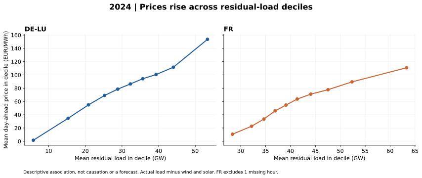

# Germany–France actual fundamentals and prices, 2024

This first descriptive analysis joins day-ahead prices to realised demand, wind and solar. Residual load is defined as **demand minus wind minus solar**. It does not subtract nuclear, hydro or other generation, and is not a measure of shortage.

## Results

| Metric | Germany / DE-LU prices | France |
|---|---:|---:|
| Hours with complete demand, wind and solar | 8,784 | 8,783 |
| Negative-price hours with complete fundamentals | 457 | 352 |
| Mean residual load in negative-price hours, GW | 4.71 | 32.20 |
| Mean residual load in nonnegative-price hours, GW | 31.46 | 42.39 |
| Mean solar output in negative-price hours, GW | 25.42 | 7.25 |
| Mean solar output in nonnegative-price hours, GW | 6.19 | 2.60 |

In both countries, negative-price hours have lower mean residual load and higher mean solar output than nonnegative-price hours. These associations do not isolate the effect of solar or control for season, time of day, weather, outages, bidding behaviour or network constraints.



Each point represents one of ten equal-frequency residual-load groups, formed separately for each country. The axes have different horizontal ranges. These are in-sample conditional means, not forecasts or fitted causal relationships.

## Event candidates

| Zone | Delivery start, UTC | Price, EUR/MWh | Residual load, GW |
|---|---|---:|---:|
| DE-LU | 12 December 2024, 16:00 | 936.28 | 66.67 |
| DE-LU | 12 May 2024, 11:00 | -135.45 | -1.41 |
| France | 13 December 2024, 16:00 | 284.21 | 70.46 |
| France | 12 May 2024, 12:00 | -87.29 | 31.16 |

These are candidates for investigation, not complete explanations. In particular, French residual load still includes demand met by nuclear generation. During its listed maximum-price hour, measured nuclear output was 52.17 GW. Generation output does not establish available capacity or prove an outage. A negative residual-load figure does not by itself establish curtailment or unrestricted export capacity.

## Sources and definitions

- Prices: user-supplied ENTSO-E GUI exports, EUR/MWh, DE-LU Sequence 1 and France Without Sequence. See [price methodology](price_comparison_2024.md) for the outstanding sequence-metadata confirmation.
- Germany: user-confirmed SMARD actual-generation and actual-consumption exports, extended around 2024. [SMARD download centre](https://www.smard.de/en/downloadcenter/download-market-data/). German national fundamentals are paired with the DE-LU bidding-zone price; Luxembourg fundamentals are not included.
- France: user-supplied [RTE éCO2mix national consolidated/definitive export](https://odre.opendatasoft.com/explore/dataset/eco2mix-national-cons-def/), filtered to the 2024 delivery year. Actual observations are labelled `Données définitives` in the supplied file. All source input hashes are in [validation JSON](fundamentals_validation_2024.json). User uploads received 19 September 2026 for fundamentals; original retrieval dates are not independently known.

German demand uses `grid load`, not `Grid load incl. hydro pumped storage`. French demand uses `Consommation (MW)`. We retain the source definitions: national load coverage, embedded generation, losses and pumping conventions have not been fully harmonised. Cross-country levels should not be interpreted as strictly like-for-like adequacy indicators. Signed French pumping and physical-exchange columns are retained without interpreting their sign in this report. Forecast columns are not used in this actuals analysis.

## Units, timestamps and missing values

1. Use UTC interval starts for joins, targeting 2023-12-31 23:00 UTC inclusive to 2024-12-31 23:00 UTC exclusive (calendar 2024 in France/Germany).
2. Localise SMARD start labels to Europe/Berlin. Source ordering disambiguates the repeated autumn hour. Validate a continuous quarter-hour UTC grid before trimming. Multiply each MWh quarter-hour observation by four to obtain average MW; average four complete samples per hour. This is equivalent to summing four quarter-hour energies and dividing by one hour.
3. Parse France's `Date et Heure` including its explicit offset, then convert to UTC. Do not strip the offset or reconstruct from the separate date and time fields. An offset representation need not use the seasonal local offset to represent the correct instant.
4. French quarter-hour rows with all selected actual fields blank are forecast-only rows. Actual observations occur at 30-minute intervals. Average two complete observations per hour as the hourly representation. This assumes each observation represents its half-hour interval; exact integrated energy has not been independently established from RTE measurement conventions.
5. At 2024-03-31 01:00 and 01:30 UTC, the source contains duplicate actual observations. All eleven selected actual columns match exactly, including missing-value patterns. Remove one copy of each; conflicting duplicates cause a hard error. This rule applies only to the selected actual columns, not to forecasts or every field in the original CSV.
6. At 2024-10-27 00:00 and 00:30 UTC, France has no actual observations. Leave the resulting hourly actuals missing. This is 02:00–03:00 CEST (the first occurrence of the repeated hour). The hour's price is retained; the hour is excluded from fundamentals statistics. **The source gap is not recovered or imputed.**
7. German nuclear markers remain missing (8,076 incomplete/missing hourly values). No zero-fill is applied. These values are not needed for residual load. Other imported main German fundamentals are complete.
8. A partial hour is never averaged as if it were complete. Source files are preserved unchanged and are git-ignored. Processed hourly data also remains git-ignored.

Calculated German residual load agrees with the supplied SMARD residual load to within 1e-8 MW. That confirms column arithmetic and units; it is not independent proof of every source measurement.

## Reproduce and inspect

Place the five filenames listed in `scripts/analyse_fundamentals.py` under `data/raw/`, then run:

```bash
python scripts/analyse_fundamentals.py
```

The script generates the processed hourly dataset with validity flags, summary tables, decile chart, selected events and validation JSON. Notebook 01 runs the same implementation. The processing script was executed on all uploaded inputs; notebook code uses that tested function, but a Jupyter kernel run was not performed in this environment. Three focused tests cover partial-hour exclusion, conflicting duplicate rejection, and the autumn clock change. The chart was visually inspected.

## Next analytical step

Investigate the event candidates using day-ahead forecasts, nuclear availability/outages, and cross-border exchange/constraint evidence. Actual-data associations are useful for retrospective explanation but must not be used as if known before the day-ahead auction. Battery optimisation remains unimplemented.
