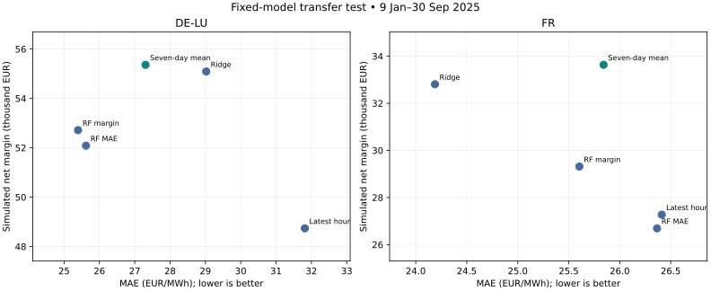

# Independent 2025 test: forecast accuracy versus battery margin

## What was frozen, and why

The protocol and executable were committed before acquiring 2025 prices: initial freeze `920694e82821c2c4d3de2556a3e22ef687dc9f8b`, with a unit-label whitespace correction from the 2024 source check in `2721a287f899fa93eed4334c728ae272669e94eb`. We tested the existing models rather than selecting new ones after seeing performance. The operational choice remains seven-day averaging in both zones. This is a previously uninspected historical holdout for this project, not a live trial.

Evaluation: 9 January–30 September 2025, 265 local delivery days / 6,359 hourly intervals per zone. January 1–8 provides historical inputs only. ML is reconstructed using the original January 9–August 30 2024 training data and fixed settings. Daily historical-price features update, but there is no refitting on 2025. Model ageing is therefore part of this transfer test.

The new API series exactly matched all 8,784 existing 2024 hourly prices in each zone (maximum difference zero). Both 2025 series passed exact hourly coverage, unique UTC timestamps, finite-price and EUR/MWh unit checks. The end date avoids the October 2025 quarter-hour product transition.

## Fixed experiment

A separate 1 MW / 2 MWh battery in each market, 90% round-trip efficiency, daily start/end SOC 50%, and EUR10/MWh discharged cycling cost. Price forecasts choose schedules before delivery; observed prices settle those unchanged schedules. Margins below are simulated operating margins after this cost, excluding fees, capex, financing, liquidity, imbalance settlement and operational failures. They are partial-period totals, not annual returns.

## Results

| Market | Fixed strategy | MAE (EUR/MWh) | Net margin (EUR) | Loss days | Gap to oracle (EUR) |
|---|---|---:|---:|---:|---:|
| DE-LU | latest_same_hour | 31.81 | 48,737.44 | 6 | 13,585.07 |
| DE-LU | seven_day_same_hour | 27.31 | 55,361.95 | 1 | 6,960.55 |
| DE-LU | ridge_alpha_0.1 | 29.02 | 55,090.56 | 4 | 7,231.95 |
| DE-LU | rf_depth_6_leaf_5 | 25.39 | 52,715.33 | 7 | 9,607.17 |
| DE-LU | rf_depth_12_leaf_20 | 25.62 | 52,086.17 | 5 | 10,236.34 |
| DE-LU | perfect_foresight | 0.00 | 62,322.51 | 0 | 0.00 |
| FR | latest_same_hour | 26.41 | 27,271.89 | 10 | 14,596.69 |
| FR | seven_day_same_hour | 25.84 | 33,633.12 | 2 | 8,235.47 |
| FR | ridge_alpha_10 | 24.19 | 32,807.20 | 1 | 9,061.38 |
| FR | rf_depth_6_leaf_20 | 25.60 | 29,313.43 | 3 | 12,555.15 |
| FR | rf_depth_12_leaf_5 | 26.37 | 26,690.26 | 6 | 15,178.32 |
| FR | perfect_foresight | 0.00 | 41,868.58 | 0 | 0.00 |

## What changed relative to the 2024 finding

**DE-LU:** seven-day averaging earned EUR55,361.95. The previously margin-selected Random Forest earned EUR52,715.33 (-2,646.62 versus the baseline), with MAE 25.39 versus 27.31. Ridge earned EUR55,090.56 (-271.39 versus the baseline).

**FR:** seven-day averaging earned EUR33,633.12. The previously margin-selected Random Forest earned EUR29,313.43 (-4,319.68 versus the baseline), with MAE 25.60 versus 25.84. Ridge earned EUR32,807.20 (-825.92 versus the baseline).

The table is a fixed-model comparison, not permission to reselect the operational strategy on this test. Lower MAE and better financial performance are distinct objectives; whether they align is an empirical result for each market and period. This one holdout cannot establish general superiority or statistical certainty.

## Losses and extremes

| Market | Strategy | Worst day (EUR) | Actual spike hours | Spike recall | Negative-price recall |
|---|---|---:|---:|---:|---:|
| DE-LU | latest_same_hour | -25.20 | 110 | 10.0% | 42.5% |
| DE-LU | seven_day_same_hour | -5.27 | 110 | 5.5% | 28.6% |
| DE-LU | ridge_alpha_0.1 | -7.62 | 110 | 5.5% | 32.5% |
| DE-LU | rf_depth_6_leaf_5 | -61.86 | 110 | 0.0% | 32.5% |
| DE-LU | rf_depth_12_leaf_20 | -71.10 | 110 | 0.0% | 33.9% |
| FR | latest_same_hour | -56.69 | 31 | 6.5% | 43.6% |
| FR | seven_day_same_hour | -65.87 | 31 | 0.0% | 36.3% |
| FR | ridge_alpha_10 | -6.62 | 31 | 0.0% | 36.1% |
| FR | rf_depth_6_leaf_20 | -17.79 | 31 | 0.0% | 34.7% |
| FR | rf_depth_12_leaf_5 | -33.13 | 31 | 0.0% | 37.9% |

A spike is a price above EUR200/MWh. Recall counts detected price events, not profitable battery actions. A battery can profit without predicting the exact spike level, and predicting an event does not guarantee the right SOC or profitable execution.

## How to use this in a job application

> Built and froze a chronological forecast-to-dispatch evaluation for DE-LU and French day-ahead markets, then tested fixed baseline, Ridge and Random Forest models on a previously uninspected 2025 period. Compared forecast error with simulated battery margin, losses and missed extremes under identical operating constraints.

This demonstrates timing-aware data engineering, optimisation, source verification and financial model evaluation. The next industry gap is execution realism: tradable bids, forecast publication vintages, continuous SOC, fees and imbalance exposure. A new extension should receive a new protocol and a new unseen test period rather than repeatedly tuning on this holdout.

## Reproduction and evidence

- Run `python scripts/evaluate_2025.py` and `python scripts/report_independent_2025.py`. Raw API JSON is cached locally; respect API rate limits on first acquisition. The 2024 source bridge can be acquired separately with `--bridge-only`.
- [Frozen protocol](../docs/independent-2025-protocol.md), [source bridge](source_bridge_2024.json), [audit and source fingerprints](independent_audit_2025.json).
- [Full metrics](independent_metrics_2025.csv), [daily results](independent_daily_2025.csv), [monthly margins](independent_monthly_2025.csv), [paired daily differences](independent_paired_daily_2025.csv).
- Runtime gates check forecast history availability, unchanged settlement dispatch and oracle dominance on all scored days. Existing suite: 15 tests passed. Workflow executed as Python scripts.
- Source: Bundesnetzagentur | SMARD.de via the [Energy-Charts API](https://api.energy-charts.info/), CC BY 4.0. Prices unmodified, transformed only into timezone-aware series for analysis. Exact requests, retrieval times, licenses and SHA256 hashes are recorded in the audit.
- SDAC timing reference: [ENTSO-E Single Day-Ahead Coupling](https://www.entsoe.eu/network_codes/cacm/implementation/sdac/).
