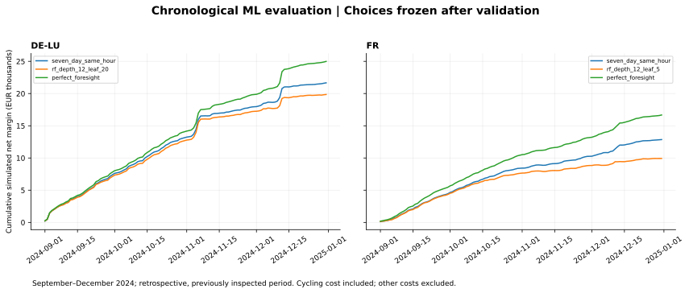

# ML price forecasts evaluated through battery decisions

## What we did and why

Implemented the [predeclared protocol](../docs/ml-evaluation-protocol.md): four Ridge settings and four Random Forest settings per zone, compared with both historical baselines. Models use only calendar and eligible historical prices. We selected candidates by validation battery margin, separately tracked the validation MAE winner, then evaluated without retuning.

Initial fitting used 9 January–29 June. Validation used 1 July–30 August. Final fitting used targets through 30 August; frozen models were evaluated from 1 September through 31 December. Feature history updates daily, but learned parameters do not. Model choices for both zones were saved before evaluation began.

**This is a retrospective chronological evaluation, not an untouched holdout:** the project had already inspected 2024. No 2025 data have been used. These results do not establish live profitability or generalisation.

## What happened to the validation choices?

- **DE-LU:** validation selected **seven_day_same_hour** for financial performance. Its evaluation net margin was **EUR 21,664.33**, a difference of **EUR 0.00** versus the seven-day baseline. The validation MAE winner was **rf_depth_12_leaf_20**; its evaluation MAE was **35.46 EUR/MWh** and net margin **EUR 19,856.80**.
- DE-LU: the margin-selected Random Forest had MAE **35.09** versus the seven-day baseline's **39.88 EUR/MWh**, but net margin was **EUR 20,022.09** versus **EUR 21,664.33**. Lower average price error did not translate into higher battery margin in this comparison. This does not isolate which prediction errors caused the difference.
- **FR:** validation selected **seven_day_same_hour** for financial performance. Its evaluation net margin was **EUR 12,857.58**, a difference of **EUR 0.00** versus the seven-day baseline. The validation MAE winner was **rf_depth_12_leaf_5**; its evaluation MAE was **27.65 EUR/MWh** and net margin **EUR 9,932.88**.
- FR: the margin-selected Random Forest had MAE **27.26** versus the seven-day baseline's **28.46 EUR/MWh**, but net margin was **EUR 11,150.65** versus **EUR 12,857.58**. Lower average price error did not translate into higher battery margin in this comparison. This does not isolate which prediction errors caused the difference.

## Evaluation results: identical 122 days / 2,929 hours per model and zone

| zone | model | mae_eur_mwh | rmse_eur_mwh | net_margin_eur | oracle_gap_eur | loss_days | worst_day_eur |
| --- | --- | --- | --- | --- | --- | --- | --- |
| DE-LU | latest_same_hour | 46.47 | 79.44 | 18,989.41 | 5,998.86 | 12 | -64.62 |
| DE-LU | seven_day_same_hour | 39.88 | 65.85 | 21,664.33 | 3,323.95 | 5 | -19.18 |
| DE-LU | ridge_alpha_0.1 | 41.52 | 67.08 | 21,493.00 | 3,495.27 | 6 | -46.96 |
| DE-LU | rf_depth_6_leaf_5 | 35.09 | 59.65 | 20,022.09 | 4,966.19 | 8 | -73.73 |
| DE-LU | rf_depth_12_leaf_20 | 35.46 | 59.85 | 19,856.80 | 5,131.47 | 11 | -41.88 |
| DE-LU | perfect_foresight | 0.00 | 0.00 | 24,988.27 | 0.00 | 0 | 11.00 |
| FR | latest_same_hour | 31.48 | 42.55 | 9,946.66 | 6,727.52 | 11 | -56.57 |
| FR | seven_day_same_hour | 28.46 | 36.54 | 12,857.58 | 3,816.60 | 4 | -35.77 |
| FR | ridge_alpha_10 | 27.51 | 33.91 | 12,547.64 | 4,126.54 | 5 | -42.61 |
| FR | rf_depth_6_leaf_20 | 27.26 | 34.16 | 11,150.65 | 5,523.53 | 6 | -68.84 |
| FR | rf_depth_12_leaf_5 | 27.65 | 34.52 | 9,932.88 | 6,741.29 | 11 | -61.23 |
| FR | perfect_foresight | 0.00 | 0.00 | 16,674.18 | 0.00 | 0 | 17.46 |

Margins are EUR for one simulated 1 MW / 2 MWh battery, after EUR 10/MWh discharged cycling cost and before other costs. Each day starts/ends at 50% SOC with 90% round-trip efficiency. Oracle MAE/RMSE are zero by construction, not predictive achievements. Compare these totals only within this evaluation period, not with earlier annual totals.



The operational choice remains the validation-selected strategy even if another candidate earns more in evaluation. Both family winners are shown, and an additional MAE winner is shown if different. These are reported comparisons, not permission to retrospectively replace the selected strategy.

## Validation: the evidence used to select candidates

| zone | model | mae_eur_mwh | net_margin_eur |
| --- | --- | --- | --- |
| DE-LU | latest_same_hour | 32.58 | 11,015.88 |
| DE-LU | seven_day_same_hour | 27.56 | 13,293.72 |
| DE-LU | ridge_alpha_0.1 | 23.87 | 12,994.83 |
| DE-LU | ridge_alpha_1 | 23.87 | 12,994.83 |
| DE-LU | ridge_alpha_10 | 23.88 | 12,958.07 |
| DE-LU | ridge_alpha_100 | 24.00 | 12,955.02 |
| DE-LU | rf_depth_6_leaf_5 | 23.84 | 13,056.51 |
| DE-LU | rf_depth_6_leaf_20 | 23.80 | 12,757.79 |
| DE-LU | rf_depth_12_leaf_5 | 23.96 | 12,693.97 |
| DE-LU | rf_depth_12_leaf_20 | 23.73 | 12,712.58 |
| FR | latest_same_hour | 30.15 | 5,572.17 |
| FR | seven_day_same_hour | 26.64 | 7,133.84 |
| FR | ridge_alpha_0.1 | 23.09 | 6,762.39 |
| FR | ridge_alpha_1 | 23.09 | 6,762.39 |
| FR | ridge_alpha_10 | 23.14 | 6,777.36 |
| FR | ridge_alpha_100 | 23.63 | 6,684.74 |
| FR | rf_depth_6_leaf_5 | 23.72 | 6,442.04 |
| FR | rf_depth_6_leaf_20 | 23.81 | 6,528.89 |
| FR | rf_depth_12_leaf_5 | 22.93 | 6,062.13 |
| FR | rf_depth_12_leaf_20 | 23.51 | 6,464.41 |

The highest validation net margin defines a near-tie set within EUR 1. Lower MAE breaks that tie; remaining ties follow the declared order. Baselines are eligible. Hyperparameters were not searched further after seeing evaluation results.

## Extreme-event diagnostics

| zone | model | spike_actual_hours | spike_predicted_hours | spike_precision | spike_recall | negative_actual_hours | negative_predicted_hours | negative_precision | negative_recall |
| --- | --- | --- | --- | --- | --- | --- | --- | --- | --- |
| DE-LU | latest_same_hour | 99 | 99 | 0.18 | 0.18 | 84 | 86 | 0.07 | 0.07 |
| DE-LU | seven_day_same_hour | 99 | 116 | 0.04 | 0.05 | 84 | 0 | nan | 0.00 |
| DE-LU | ridge_alpha_0.1 | 99 | 93 | 0.07 | 0.07 | 84 | 11 | 0.36 | 0.05 |
| DE-LU | rf_depth_6_leaf_5 | 99 | 0 | nan | 0.00 | 84 | 47 | 0.53 | 0.30 |
| DE-LU | rf_depth_12_leaf_20 | 99 | 0 | nan | 0.00 | 84 | 46 | 0.48 | 0.26 |
| FR | latest_same_hour | 25 | 25 | 0.24 | 0.24 | 30 | 30 | 0.10 | 0.10 |
| FR | seven_day_same_hour | 25 | 0 | nan | 0.00 | 30 | 2 | 0.00 | 0.00 |
| FR | ridge_alpha_10 | 25 | 0 | nan | 0.00 | 30 | 14 | 0.36 | 0.17 |
| FR | rf_depth_6_leaf_20 | 25 | 0 | nan | 0.00 | 30 | 31 | 0.32 | 0.33 |
| FR | rf_depth_12_leaf_5 | 25 | 0 | nan | 0.00 | 30 | 35 | 0.31 | 0.37 |

Spikes are strictly above EUR 200/MWh; negatives strictly below zero. Precision/recall are fractions; undefined ratios remain missing. Event classification is distinct from battery action and whole-day margin. The earlier loss analysis explains why missed threshold crossings need not prevent profitable discharge.

## Implementation and validation

Features are target hour sine/cosine, weekday indicators, latest same-hour price, seven-day same-hour mean/std/min/max, and mean of seven daily mean prices. History is D-8 through D-2, with a D-1 09:00 local experimental decision cutoff. Every training row reconstructs its own historical information set. Ridge scales numeric columns using training statistics only; weekday indicators remain unscaled. Random Forest uses unscaled inputs, 200 trees and seed 42.

The JSON configuration stores max_features as 1; implementation explicitly casts to float 1.0, preserving the protocol's all-features setting rather than sklearn's integer-one-feature meaning. This is a type clarification, not a post-result hyperparameter change.

Checks cover source continuity, eligible training targets, future-data perturbation, frozen preprocessing/predictions, DST hours, near-tie selection, physical feasibility, unchanged dispatch at settlement and same-day oracle dominance. No future actual fundamentals were used. The notebook wrapper is syntax-checked; end-to-end execution was through the Python script, not a Jupyter kernel.

Important remaining limits: historical price publication vintages are unverified; German Sequence 1 product metadata is still pending; quantities are assumed fully accepted; fees, grid tariffs, capex and other operating costs are excluded; daily SOC reset prevents inter-day arbitrage. Features have no weather, forward fundamentals or cross-market information. A short seasonal validation window and a frozen model may not transfer well to autumn/winter; the present comparison does not isolate the cause of any performance change.

## Reproduction and outputs

```bash
python -m pip install -r requirements.txt
python scripts/analyse_fundamentals.py  # if processed data is absent
python scripts/analyse_ml.py
PYTHONPATH=src python -m unittest discover -s tests
```

- [Frozen selections](ml_selection_2024.json)
- [All metrics](ml_metrics_2024.csv)
- [Daily results](ml_daily_2024.csv) and [monthly results](ml_monthly_2024.csv)
- [Paired daily differences versus seven-day baseline](ml_paired_daily_2024.csv)
- [Training-boundary audit](ml_fit_audit_2024.csv)
- [Versions, hashes, parameters and checks](ml_validation_2024.json)

Full hourly schedules and feature-time audit are recreated in git-ignored data/processed/ml_dispatch_2024.csv and ml_feature_timing_2024.csv.

## Next step

Review whether validation-selected accuracy and financial advantages persisted, without retuning on this evaluation period. Freeze this run as a benchmark. Any new features, rolling refits or alternative objective require a separately versioned experiment and genuinely uninspected data for stronger evidence. Do not present an ML result as an upgrade merely because it is more complex.
