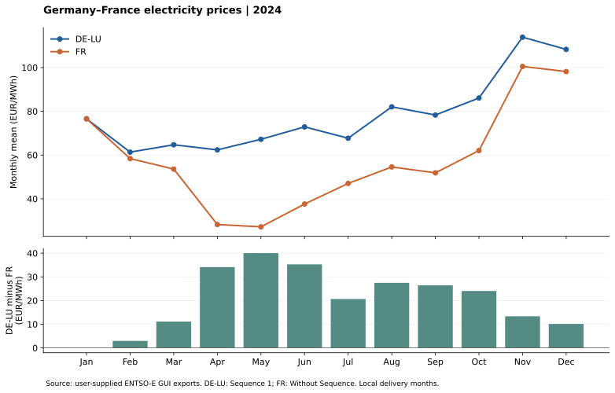

# 2024 price comparison

Source: two user-supplied CSV exports with ENTSO-E GUI Energy Prices headers. Uploaded 17 September 2026. Retrieval date was not supplied. Source portal: https://transparency.entsoe.eu/

## Selection and validation

France contains 8,784 hourly rows, labelled `Without Sequence`. DE-LU contains 70,272 rows: two sequences of 35,136 quarter-hours each. We select `Sequence 1` explicitly; never average the two sequences. All four Sequence 1 prices within every UTC delivery hour are identical. Collapse these four rows to one hourly value. Sequence 2 is excluded; its precise product definition has not been established from the CSV metadata.

This selection is consistent with hourly 2024 day-ahead pricing and the published SMARD annual means (DE-LU 78.51 and FR 58.02 EUR/MWh): https://www.smard.de/page/en/topic-article/5892/219038/record-high-for-solar-generation-in-each-quarter
The agreement is a cross-check, not proof of auction identity. Confirm the sequence definition against source auction metadata before extending to other years/products.

The parser checks zone, numeric finite prices, interval lengths, complete chronological coverage and hourly constancy. CET/CEST suffixes resolve the repeated autumn hour. UTC is used for joins; Europe/Berlin local delivery months for aggregation. Both zones have 8,784 common hours, including 23 hours on 31 March and 25 on 27 October. No missing prices or intervals occur in the selected series. The period is 2023-12-31 23:00 UTC inclusive to 2024-12-31 23:00 UTC exclusive.

## Observations

| Metric | DE-LU | France |
|---|---:|---:|
| Mean, EUR/MWh | 78.51 | 58.02 |
| Minimum, EUR/MWh | -135.45 | -87.29 |
| Maximum, EUR/MWh | 936.28 | 284.21 |
| Negative-price hours | 457 | 352 |

The mean DE-LU minus FR spread is 20.49 EUR/MWh. DE-LU has 105 more negative-price hours despite its higher annual mean. This illustrates why a mean alone cannot describe the price distribution. These are time averages, not volume-weighted purchase costs.

Prices alone do not establish causes, congestion or physical scarcity. Next add demand, wind, solar, nuclear availability and cross-border evidence to investigate selected events. No battery revenue or forecast performance has been calculated.

## Reproduce

Put the two unmodified exports in `data/raw/`. With dependencies installed, run `python scripts/analyse_prices.py` from the repository root, or open notebook 01. The importer identifies files by their Area column. Raw and processed price series remain git-ignored. The repository includes code, aggregate statistics and figures. Source redistribution terms have not been verified; do not add raw exports without checking them.

## Input fingerprints

- `GUI_ENERGY_PRICES_202312312300-202412312300 (1).csv` — SHA-256 `f90eb81e630de27176aca9c3ad02046026d65c9ab94d9d855774de0675d018fd`

- `GUI_ENERGY_PRICES_202312312300-202412312300.csv` — SHA-256 `4fdf6e02330284354f7c594169180229f447e5f575b942cca40f877f504afde7`
